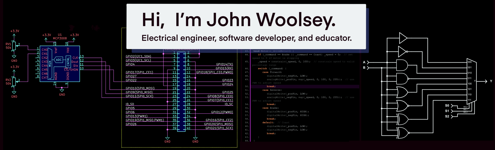

I have a background in semiconductor design and application development, but my passion is teaching others how to design and build software and electronics under the [Woolsey Workshop](https://www.woolseyworkshop.com) brand. It provides tutorials, code, and other resources covering a range of electronics and software topics, especially those of interest to the open source maker community and educational institutions. Topics typically cover Arduino, Raspberry Pi, and CircuitPython platforms; sensor, actuator, and display interfacing; embedded programming; and general circuit design and simulation.

Please consider sponsoring my work. [:heart: Woolsey Workshop](https://github.com/sponsors/WoolseyWorkshop)

You can also find me on [Twitter](https://twitter.com/JohnWWoolsey) and [LinkedIn](https://www.linkedin.com/in/johnwwoolsey/).

<!--
**woolseyj/woolseyj** is a ✨ _special_ ✨ repository because its `README.md` (this file) appears on your GitHub profile.

Here are some ideas to get you started:

- 🔭 I’m currently working on ...
- 🌱 I’m currently learning ...
- 👯 I’m looking to collaborate on ...
- 🤔 I’m looking for help with ...
- 💬 Ask me about ...
- 📫 How to reach me: ...
- 😄 Pronouns: ...
- ⚡ Fun fact: ...
-->
